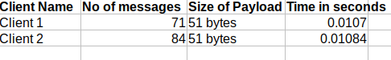

# Assignment report 2

### CS-E4640 Big data platforms 
#### Rohit Raj ([rohit.raj@aalto.fi](mailto:rohit.raj@aalto.fi)) - 801636
---
## Part 1
### Design of the project

The project has basically two ingestion methods:

* __Stream Ingestion__
* __Batch Ingestion__

Each of these ingestion methods operate separately and independently. However, the data sink is same for both these systems. That is, the data/file is finally stored inside the sharded `Mongodb` instance (mysimbdp-coredms) designed in the previous assignment.

The different components and data flow design of the system is illustrated in the following diagram:


* Fig 1: Ingestion Architecture

### Batch Ingestion:

The batch ingestion has following components:
* __mysimbdp-fetchdata__
* __Batch Ingest Manager__
* __Client Batching Ingest App__

The batching ingest app is responsible for copying the file into the system.

### Mysimbdp-FetchData

The role of this component is to move the data from the `client-input-directory` to staging destination. It keeps on constantly checking the directory for any existence of any file. 

Whenever a file is detected in the folder, `Fetch-data` loads the __*`config.json`*__ file. The `config.json` file has two types of validation/ configuration 

1. *Generic Configuration* : These include general validation tests that all files have to pass irrespective of the client. We can say that this is enforced by the mysimbdp. Some of the examples are max file size limit should not exceed 100Mb, or the filename should not be bigger than 20 characters.  

2. *Client-specific configurations* : This configuration data is specific for every client. Every client has a unique clientID which can be used to uniquely identify the system. For example: Client 1 has turned on micro-batching based on incoming file size. Moreover, it has also defined the block length to be 10Mb. We also have other client specific checks like accepted data formats etc. 

The `fetchData` component actively first validates the generic configuration checks and then proceeds to check the client specific configuration. 

If the file passes all these checks, the file is then prepared to be moved to staging. If the client's config data has enabled micro batching, the file is then split into multiple smaller files. (For example: Client 1 has enabled microbatching on config.json and if the file size is more than 10Mb, it will automatically be split into blocks of 10 Mb each.)

The file is our implementation, is moved to staging which is a folder in our system(only for demonstration, ideally it should be on moved to a network mounted disk on cloud). This movement is done using the `shutil` library of python, that can move across files through disk drives. Each of the file is moved according to a specified directory structure. For example: `client 1's` file would be moved to `staging/client_1_temp`. 

Finally, the fetch data sends a MQTT request via the `Mosquitto` broker with the `client_ID` as payload to the batch-ingest manager. 

If the file doesn't match any of the file name or client's file regex, it not deleted, rather is moved to a discarded directory. The reason behind this move is that, engineers can later look at the files to see why this was discarded. We don't want to lose client's data due to some internal bug and thus, that file could be ingested manually by the our engineers.

### Batch Ingest Manager

The batch ingest manager is responsible for calling/running the client's script whenever a file of that company is moved into the storage.

It is always listening to the requests onto the MQTT mosquitto broker i.e. it acts as a subscriber on the topic `topic/big_data_9ff5e`. The messages on this topic, contain the `Client_ID` of the client whose file has been moved into the staging environment. We have assumed that the clientID is constant in the system and hence all the client scripts can be traced from it.

Once, it receives the request, the manager first fetches the `clientingestapp` script name for this client. In our demonstration both the `clientingestapp`'s are written in python, however, our manager cn execute any language code as long as it's installed into the host operating system.

The `clientingestapp` is called using `subprocess.Popen()` method. This creates a new process for the app instead of thread. The motivation for using a process instead of thread is following: Each ingest app should run independent of the manager and thus memory management should be taken care of by the host OS and not be a responsibility of our manager.

### Client Ingest Application

The client ingest app should be provided by the client company, and it should be the role of batch ingest manager to call it. 

Each ClientIngestApp is responsible for ingestion of that particular client's files into the sink (MongoDB in our case). 

The ingest architecture and `mysimbdp-coredms` are very flexible on the type of ingestion mechanism for files. We allow both traditional data storage into the mongo collections as well as object storage into gridFS buckets in mongoDB. This allows extreme scalability during ingestion as well as egestion for analytics. 


* Fig 2: GridFS chunk storage

The figure above illustrates the architecture that client 1 is using. It connects to the mongoDB using the gridfs drivers and stores the data as an object in chunks into the DB. The file metadata is then saved using the pymongo driver into a separate mongoDB collection. We can then fetch the file from chunk using this metadata. This is the object-driven storage for handling files that gives us very good performance. 

Client 2 on the other hand is using classic approach to save the data into the database. We will see the relative performance ingestion speed in upcoming sections.

#### Performance and failures

Client 1 used gridfs while client 2 used collection in mongodb.

We can see the relative performance of these two ingestion methods in the following graph:


* Fig 3: Client1 vs Client2 performance

It can be seen that client 1 was extremely quicker than client 2 because of using object type storage. It completed ingestion of 50Mb of file in 0.7 seconds as compared to 10+ seconds on client 2. The `fetch-data` component took the same time in both the cases because the movement was on the local system itself. However this drastic speed difference in ingestion rate shows how implementation choice can affect the speed of ingestion.

There were no ingestion failures observed.  However, there were some small bugs and edge cases in the code that were fixed during development. They can be seen in the log files as `[ERRORS]`.

### Logging Features :

The logging has been implemented in every file and can be used to leverage reasons behind the failures, errors and validation results. Additionally, we have also logged timing data in these logs for performance measurements.

To check the performance data any log we can use :

```bash
cat logName.log | grep TIMING
```
The performance logs are `info` level logs. The discard logs are `warning` level logs.

For example performance logs for batching of client 1 was (We can also notice file joining timings) :


* Fig 4: GridFS chunk storage

We can also see that the errors and issues are mostly present on the top of `.log` files. This was because of coding/error and ingestion specific errors. They were fixed/removed later to test for performance. (Note: If you notice the Figure 4 above, we can see that the join time for the very first line is in negative. This was due to a bug that was subsequently fixed.)

The errors are also always accompanied with fileName and call stack as to allow easy debugging of the underlying issue.

#### Answers to questions of part 1

1. The `config.json` was used for defining the constraints. (Explained above in detail)

2. mysimbdp-fetchdata has been implemented (Explained above)

3. `mysimbdp-batchingestmanager` has been designed and implemented that invokes the `clientbatchingestapp`.

4. 2 test programs were created. One used gridFS object storage and other used collection based storage. Constraints like extension limiting, file name limiting using regex and enabling automatic micro-splitting was profiled in `config.json`. I experienced different types of errors/bugs while ingestion of the app. The errors are mostly at the top of log files, as they were fixed/removed before testing the performance. Performance metrics are shown and compared above.

5. The logging has been implemented for every component(including the client test scripts for stream and batch loading part). They can be seen in the `logs/` folder. The timing, data-size etc, performance metrics can be found in the respective client's log directory.

---

## Part 2 - Stream ingest 

### Design of stream ingest

The stream ingest is responsible for ingestion of streaming data coming from various sources. In our project we are using a message broker for streaming ingest. The design pattern used is `publisher/subscriber` model. In this pattern, the producer of the data publishes(sends the data) to a particular topic. Whereas the consumer of the data subscribes(listens on) to the same topic. The message broker acts as a facilitator between the the publisher and subscriber. 


### Mosquitto (mysimbdp-dataBroker) and MQTT

The broker used in our project is `Mosquitto` which is an open-source broker for MQTT protocol. 
The variant of Mosquitto used was `eclipse-mosquitto`'s docker image. It runs TCP connections on port 1883 and websocket on port 9000. It allows automatic topic creation whenever a publisher or subscriber got attached to the broker. 

* __`MQTT`__ : MQTT stands for Message Queue Telemetry Transport and is a lightweight protocol mainly used for transmission of data in energy-constrained and bandwidth constrained devices especially in Internet of Things(IoT). 

The `mosquitto` broker in our project performs the following actions:

#### 1. Ingestion of streaming data:

Each client has a unique topic on which the client can publish to. The broker is supposed to always keep running and listen on these topics.

On the other end, the `clientIngestApp` is created by the `stream-ingestmanager`.The clientIngestApp is responsible for subscribing to the same topic and saving the file in the database. 

#### 2. Notification to BatchIngestManager

The mosquitto broker also acts notification service backbone for batch ingest. When the fetchData service from the previous component has moved the file to staging, it sends the mqtt notification request to batchIngestManager. The `batchIngestManager` then calls the `clientbatchningestapp` which starts the batch loading of files.

#### 3. Reporting of Metadata from ClientStreamIngestApp to StreamIngestManager

The `ClientStreamIngestApp` also uses the broker, to send the reporting data in a particular format to the `StreamIngestManager`. It sends the report along with the clientName every 60 seconds. The `StreamIngestManager` can then dynamically scale up or down the processes depending on the report.


Hence, we can see the that the message broker (`Mosquitto`) forms the backbone of our streaming data as well as the notification and metadata transfers.

### StreamIngestManager

This component is responsible for creating and destroying the instances(processes) of `clientStreamIngestApp`. The `clientingestapp` is called using `subprocess.Popen()` method. This creates a new process for the app instead of thread. The motivation behind this is the same as described in the part-1.

To *__invoke on-demand__* clientStreamIngestApp, we need to use the following command on `mysimbdpstreamingestmanager.py`:

```bash

$ python3  mysimbdpstreamingestmanager.py action_name client_name process_id

```

* action can be : `start`/`stop`
* client_name: `client1`/`client2`
* process_id: `0` in case of start. `pid` to stop in case action is `stop` 

Additionally, the stream ingest manager also has a `reporting-service.py` component. This listens to topic `big_data_reporting` on the local mosquitto broker and then scales up and down by calling the `run_command` of the `mysimbdpstreamingestmanager.py`.

### ClientStreamIngestApp

The client stream ingest application is called by the `StreamIngestManager`. Each of these are provided  by the client and are just executed by our manager. They are responsible for ingestion of stream data into the system. 

`Mysimbdp` enforces the `ingestmessagestructure` for all the clients. The structure should be a json dictionary with defined fields ex: `{'item1': 'value', 'item2': 'value2'}`. This is the structure that the client should be broadcasting onto the MQTT and should be saved in the database. 

The clientIngestApp has a unique MQTT topic that it subscribes to and it ingests the streaming data into the mongoDB into the collections(as a key value pair).

#### Performance of clients test scripts:

The client test scripts for both the clients were tested on same system. Following were the results obtained:


* Table 1 : Average Client stream ingest time

We can see since both the clients were following the same message ingest structure, and both were using the same other software components such as broker and database, the ingestion time is quite similar for both of them.

I did not observe any failure. There were however, some bugs that can been seen on the top of log files. They were fixed during the development process and before the performance test.

#### Reporting format and scaling of client ingest APP:

For the dynamic scaling by the batchstreamingestmanager, we have used the following custom reporting format:
```json
[
    "client_name",
    "average_processing_time",
    "total_number_of_messages_ingested",
    "total_size_of_messages_ingested"
]
```
The reason for this format was easy to parse structure. This enum like python list can be converted from string payload to a python list by single line `eval()` statement.

The reporting is done by sending MQTT publications to `streamingesmanager` via the local Mosquitto broker. The client sends the mqtt report every one minute to streamManager's `reporting_service.py`. (However, only for the sake of quick testing, the interval of reporting time was reduced to 6 seconds temporarily).

In case of scaleup, the reporting_service then saves the pid of newly created process in a global variable. In case we need to scale down, it pops the process_id from this global variable and stops it. The start and stop takes place using the commands defined in `StreamIngestManager` subsection of this report.


### Specific Answers to part -2 

1. The `ingestmessagestructure` should have a JSON like schema. An example is as follows :

```json
{  "id" : "some_data",
    "name" : "some_data",
    "host_id" : "some_data",
    "host_name" : "some_data",
    ...
    ...
    ...
}
```
Having a schema like this makes it easy to parse during ingestion and debug the code. This also means an easier dimensionality reduction for analytics. In our implementation, both Client1 and Client2 follow this schema albeit with different values. 

2. `mysimbdp-streamingestmanager` has been implemented and the command to invoke on-demand `clientStreamIngestApp` can be seen in the  `StreamIngestManager` subsection above.

3. `clientstreamingestapp` for 2 customers was also developed. Performance, failures, errors and other details are provided in the subsection above. Logs can be opened to see specific errors.

4. The reporting format was also described in the previous section and the mechanism used for reporting as the MQTT requests on a single topic via the mosquitto broker. `big_data_reporting` was the topic that all the `clientStreamIngestApp`s reported to the `reported_service.py`.

5. The dynamic scaling up and down based on the reporting data by the streamingIngestManager was also __implemented__ and has been described in details in the previous subsection.

---

## Part 3

#### 1. Integrated architecture:

The integrated architecure would be similar to the lamdba architecture[1], where we can have real-time ingestion as well as batch processing both combined into one. Our `fetchData` and `batch-ingest-manager` would combine to become our batch layer of lambda architecture. It will be an example of connecting pipeline one (fetchdata's file movement) to another pipeline (object storage drivers such as fsGrid) ingestion. 

The Mosquitto message broker along with `stream-ingest-manager` becomes our real-time layer(speed layer). It will allow us to ingest small but quick data (such as IoT sensor data).

#### 2. Micro-batching in our system

In our design, if the file size is more than 10Mb and if the company has enabled micro-batching, the files will be split into sizes of 10Mb each and then moved to staging. This will be done by our `fetch-data` component.

After splitting, the file chunks are moved into the staging folder one by one. The join of the file is then the responsibility of `clientBatchIngestApp`. It will join the chunks and then save the file into the final database. The split and join function can be seen in the respective code files.

Since, many small files are moved, instead of one big file the bandwidth will not be chocked that much. If the movement is across the network, TCP might then be able to work it's congestion control mechanisms.

We have not used broker for transmitting file chunk, instead we have used the batch layer because to keep maintaining the ingestion speed of general stream data. Sending batch files over the broker(even smaller chunks) can slow down the overall ingestion time for real-time data.

#### 3. Code independence:

We should as a platform provider need not look at the code because :
* Code and ingestion logic of clients many times contain trade secrets and sensitive information. This may drive the customer away if we insist on looking at their code.  
* With the advent of lightweight containers, it is very easy to isolate the client processes thereby damage from malicious client's code can be prevented to an extent. 

#### 4. Quality of data

If we want to maintain the quality of data, we can start by first enforcing a strict set of constrains on our database. MongoDB supports different types of constrains on a collection, and we can leverage that ensure only data that conforms to certain constrains goes into the database.

Secondly, we can read the binary file to see if the client-scripts are good enough to be run onto the our platform.

Thirdly, we can create an extensive guidelines of our platform  and data ingestion pattern that could provide exact implementation details and send them to the clients. (This would be similar to RFC's that we have for different technologies)

#### 5. Multiple client apps

If the customer has multiple client batching app and/or client streaming apps, we can extend our architecture in the following way:

The `mysimbdp-batchIngestManager` and `mysimbdp-streamIngestManager` both have a direct mapping of fileName with the clientID. IN addition to that we can add the extension information to the mapping data. For example instead of writing  `GetFileName(Client1) = abc.py`, we will have `GetFileName(Client1, typeOfData) = abc_1.py`. 

At the moment, this information is saved as a global variable, but if the size of data types and clients grow, we can use some in-memory database such as `Redis` to store the filename, extentionType and clientID for every client. We can then call `GetFromRedis` to get the value and then execute the file from `subprocess.Popen` as we currently do. ScaleUp and down would work the same way.


---

## Bonus Part

### Part 1

The dynamic management of instances has been implemented in the architecure. `reporting_service.py` is the file that listens to the incoming reports from the client apps via Mosquitto.   


The scaling up or down was then by the following logic in `reporting_service.py` code:

```python
    if avg_processing_time > max_processing_time_threshold:
        scaleup(client_name)
    if avg_processing_time < min_processing_time_threshold:
        scaledown(client_name)
    if number_of_messages > max_number_of_messages: # we need to scale down in this case as processing rate is too high
        scaledown(client_name)
    if number_of_messages < min_number_of_messages:
        scaleup(client_name) 
```
The thresholds were 

    max_processing_time_threshold = 0.05 seconds
    min_processing_time_threshold = 0.005 seconds
    max_number_of_messages = 6000000
    min_number_of_messages = 600000

As mentioned earlier, the scale up and down is done by creating/destroying processes in the system. The process id for every client process is stored as a global variable. In a better production environment, we can move this to a in-memory database such as `Redis` or `Memcached`. This would allow easier management of the spawned processes.

### Part 2

The details of implementation micro-batching has been described in answer to part 2 question 3. One good feature of our micro-batching is that it can be enabled on per-client basis. This will allow flexibility of the client to use our platform. 

Our architecture doesn't send the data over the broker, rather the small files are sent over the batch layer `shutil` copier itself.  As mentioned before, sending batch files over the broker(even smaller chunks) can slow down the overall ingestion time for real-time data and can slow down our real-time analytics. So, this was a design-tradeoff that was made to ensure high performance of our real time ingestion.


---

References:

[1] http://lambda-architecture.net/