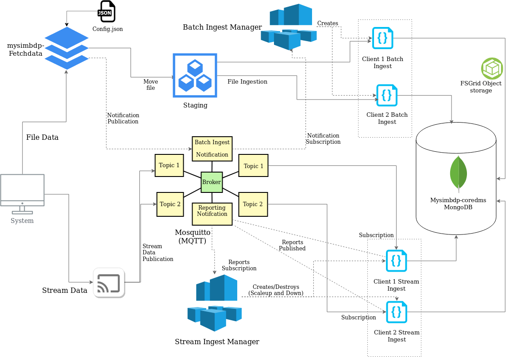
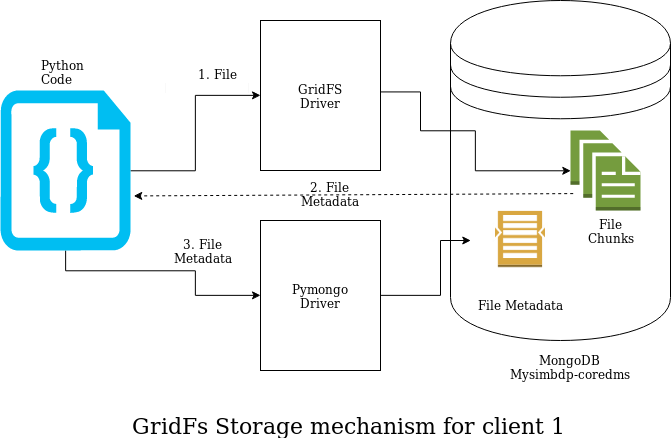
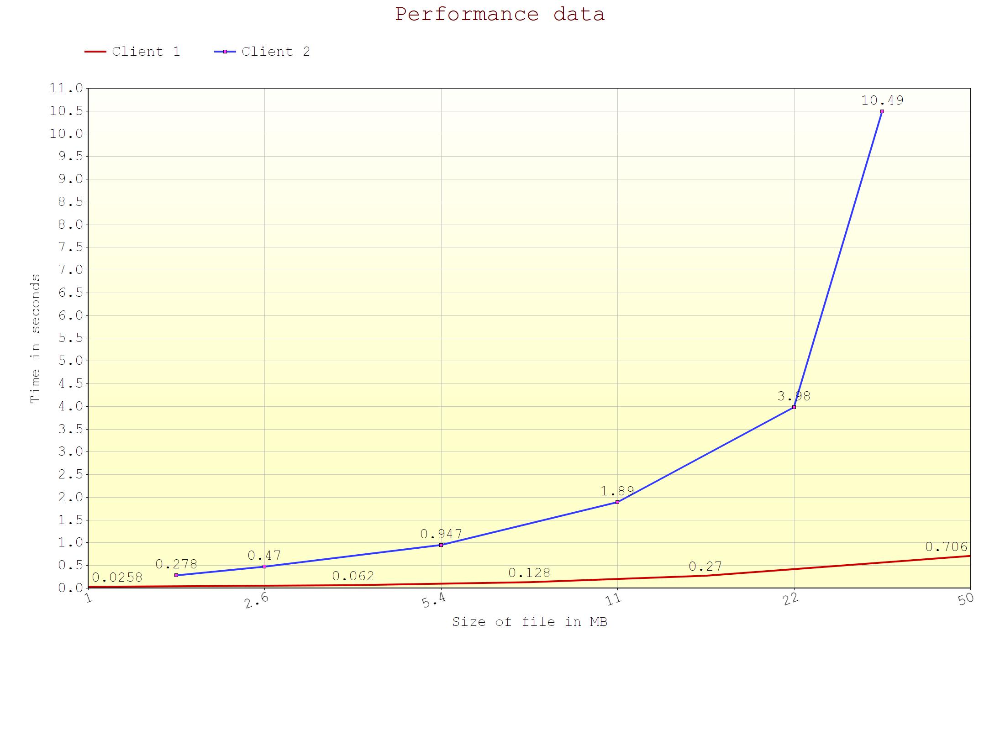
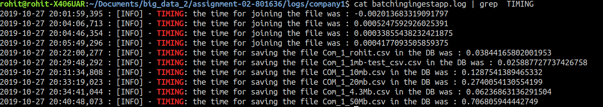

# Assignment report 2

### CS-E4640 Big data platforms 
#### Rohit Raj ([rohit.raj@aalto.fi](mailto:rohit.raj@aalto.fi)) - 801636
---
## Part 1
### Design of the project

The project has basically two ingestion methods:

* __Stream Ingestion__
* __Batch Ingestion__

Each of these ingestion methods operate separately and independently. However, the data sink is same for both these systems. That is, the data/file is finally stored inside the sharded `Mongodb` instance (mysimbdp-coredms) designed in the previous assignment.

The different components and data flow design of the system is illustrated in the following diagram:


* Fig 1: Ingestion Architecture

### Batch Ingestion:

The batch ingestion has following components:
* __mysimbdp-fetchdata__
* __Batch Ingest Manager__
* __Client Batching Ingest App__

The batching ingest app is responsible for copying the file into the system.

### Mysimbdp-FetchData

The role of this component is to move the data from the `client-input-directory` to staging destination. It keeps on constantly checking the directory for any existence of any file. 

Whenever a file is detected in the folder, `Fetch-data` loads the __*`config.json`*__ file. The `config.json` file has two types of validation/ configuration 

1. *Generic Configuration* : These include general validation tests that all files have to pass irrespective of the client. We can say that this is enforced by the mysimbdp. Some of the examples are max file size limit should not exceed 100Mb, or the filename should not be bigger than 20 characters.  

2. *Client-specific configurations* : This configuration data is specific for every client. Every client has a unique clientID which can be used to uniquely identify the system. For example: Client 1 has turned on micro-batching based on incoming file size. Moreover, it has also defined the block length to be 10Mb. We also have other client specific checks like accepted data formats etc. 

The `fetchData` component actively first validates the generic configuration checks and then proceeds to check the client specific configuration. 

If the file passes all these checks, the file is then prepared to be moved to staging. If the client's config data has enabled micro batching, the file is then split into multiple smaller files. (For example: Client 1 has enabled microbatching on config.json and if the file size is more than 10Mb, it will automatically be split into blocks of 10 Mb each.)

The file is our implementation, is moved to staging which is a folder in our system(only for demonstration, ideally it should be on moved to a network mounted disk on cloud). This movement is done using the `shutil` library of python, that can move across files through disk drives. Each of the file is moved according to a specified directory structure. For example: `client 1's` file would be moved to `staging/client_1_temp`. 

Finally, the fetch data sends a MQTT request via the `Mosquitto` broker with the `client_ID` as payload to the batch-ingest manager. 

If the file doesn't match any of the file name or client's file regex, it not deleted, rather is moved to a discarded directory. The reason behind this move is that, engineers can later look at the files to see why this was discarded. We don't want to lose client's data due to some internal bug and thus, that file could be ingested manually by the our engineers.

### Batch Ingest Manager

The batch ingest manager is responsible for calling/running the client's script whenever a file of that company is moved into the storage.

It is always listening to the requests onto the MQTT mosquitto broker i.e. it acts as a subscriber on the topic `topic/big_data_9ff5e`. The messages on this topic, contain the `Client_ID` of the client whose file has been moved into the staging environment. We have assumed that the clientID is constant in the system and hence all the client scripts can be traced from it.

Once, it receives the request, the manager first fetches the `clientingestapp` script name for this client. In our demonstration both the `clientingestapp`'s are written in python, however, our manager cn execute any language code as long as it's installed into the host operating system.

The `clientingestapp` is called using `subprocess.Popen()` method. This creates a new process for the app instead of thread. The motivation for using a process instead of thread is following: Each ingest app should run independent of the manager and thus memory management should be taken care of by the host OS and not be a responsibility of our manager.

### Client Ingest Application

The client ingest app should be provided by the client company, and it should be the role of batch ingest manager to call it. 

Each ClientIngestApp is responsible for ingestion of that particular client's files into the sink (MongoDB in our case). 

The ingest architecture and `mysimbdp-coredms` are very flexible on the type of ingestion mechanism for files. We allow both traditional data storage into the mongo collections as well as object storage into gridFS buckets in mongoDB. This allows extreme scalability during ingestion as well as egestion for analytics. 


* Fig 2: GridFS chunk storage

The figure above illustrates the architecture that client 1 is using. It connects to the mongoDB using the gridfs drivers and stores the data as an object in chunks into the DB. The file metadata is then saved using the pymongo driver into a separate mongoDB collection. We can then fetch the file from chunk using this metadata. This is the object-driven storage for handling files that gives us very good performance. 

Client 2 on the other hand is using classic approach to save the data into the database. We will see the relative performance ingestion speed in upcoming sections.

#### Performance and failures

Client 1 used gridfs while client 2 used collection in mongodb.

We can see the relative performance of these two ingestion methods in the following graph:


* Fig 3: Client1 vs Client2 performance

It can be seen that client 1 was extremely quicker than client 2 because of using object type storage. It completed ingestion of 50Mb of file in 0.7 seconds as compared to 10+ seconds on client 2. The `fetch-data` component took the same time in both the cases because the movement was on the local system itself. However this drastic speed difference in ingestion rate shows how implementation choice can affect the speed of ingestion.

There were no ingestion failures observed.  However, there were some small bugs and edge cases in the code that were fixed during development. They can be seen in the log files as `[ERRORS]`.

### Logging Features :

The logging has been implemented in every file and can be used to leverage reasons behind the failures, errors and validation results. Additionally, we have also logged timing data in these logs for performance measurements.

To check the performance data any log we can use :

```bash
cat logName.log | grep TIMING
```
The performance logs are `info` level logs. The discard logs are `warning` level logs.

For example performance logs for batching of client 1 was (We can also notice file joining timings) :


* Fig 4: GridFS chunk storage

We can also see that the errors and issues are mostly present on the top of `.log` files. This was because of coding/error and ingestion specific errors. They were fixed/removed later to test for performance. (Note: If you notice the Figure 4 above, we can see that the join time for the very first line is in negative. This was due to a bug that was subsequently fixed.)

The errors are also always accompanied with fileName and call stack as to allow easy debugging of the underlying issue.

#### Answers to questions of part 1

1. The `config.json` was used for defining the constraints. (Explained above in detail)

2. mysimbdp-fetchdata has been implemented (Explained above)

3. `mysimbdp-batchingestmanager` has been designed and implemented that invokes the `clientbatchingestapp`.

4. 2 test programs were created. One used gridFS object storage and other used collection based storage. Constraints like extension limiting, file name limiting using regex and enabling automatic micro-splitting was profiled in `config.json`. I experienced different types of errors/bugs while ingestion of the app. The errors are mostly at the top of log files, as they were fixed/removed before testing the performance. Performance metrics are shown and compared above.

5. The logging has been implemented for every component(including the client test scripts for stream and batch loading part). They can be seen in the `logs/` folder. The timing, data-size etc, performance metrics can be found in the respective client's log directory.